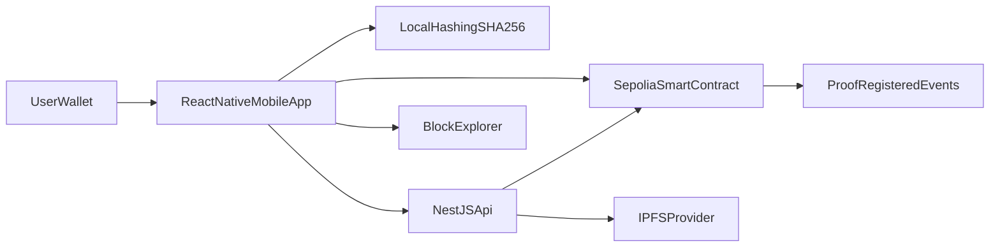

# ProofChain Implementation Plan

## 1) Define Product Scope and Trust Model

- Lock scope to two core journeys:
  - `Notarize`: user selects file, app computes hash, stores proof on-chain (+ optional IPFS metadata).
  - `Verify`: user re-hashes a provided file and checks recorded proof integrity + timestamp.
- Demo-only scope guardrails (to hit 5-day deadline):
  - Support a single chain only (`Sepolia`).
  - Support single wallet path (WalletConnect with one tested wallet app).
  - No user accounts, no roles, no multi-tenant features.
  - No advanced indexing/database in MVP unless absolutely required.
- Define what the app proves:
  - Existence at or before block timestamp.
  - Integrity via identical cryptographic digest.
  - Ownership linkage via wallet address used to notarize.
- Decide baseline assumptions:
  - Do **not** store full file on-chain.
  - Store only hash and minimal metadata pointer.
  - Treat blockchain state as source of truth.

## 2) Architecture and Repository Setup

- Use a monorepo with apps/packages:
  - `apps/mobile` → React Native (Expo SDK latest stable) user mobile UI.
  - `apps/api` → NestJS (Node 22+, TypeScript) backend/API.
  - `apps/contracts` → Hardhat or Foundry Solidity project.
  - `packages/shared` → shared types, DTO schemas, constants.
- Establish environment strategy:
  - `.env.example` per app.
  - Distinct configs for local, testnet, CI.
- Add CI baseline:
  - Lint, type-check, test for each app.
  - Contract compile/test + optional gas snapshot.

## 3) Smart Contract Design (Core Proof Registry)

- Implement a minimal, auditable Solidity contract:
  - Mapping from `bytes32 fileHash => ProofRecord`.
  - `ProofRecord` fields:
    - `owner` (address)
    - `timestamp` (uint64/uint256)
    - `blockNumber` (uint64/uint256)
    - `ipfsCid` (string, optional)
    - `exists` (bool)
- Functions:
  - `registerProof(bytes32 hash, string calldata ipfsCid)`
  - `getProof(bytes32 hash)` (view)
  - optional `verifyProof(bytes32 hash)` helper returning exists + record.
- Rules:
  - Reject duplicate registration for same hash (or support multi-owner explicitly; choose one and document).
  - Emit indexed events (`ProofRegistered(hash, owner, timestamp, blockNumber, ipfsCid)`) for off-chain indexing.
- Add contract tests:
  - Successful registration.
  - Duplicate behavior.
  - Retrieval accuracy.
  - Event assertions.
  - Access and edge-case testing.

## 4) Blockchain Environment and Deployment

- Choose Ethereum testnet (recommend `Sepolia`).
- Set up deploy scripts:
  - deterministic config via env vars (`RPC_URL`, `PRIVATE_KEY`, `CHAIN_ID`).
  - output ABI + deployed address into shared package for frontend/backend consumption.
- Add verification steps:
  - Confirm deployment with explorer link.
  - Run post-deploy smoke call (`getProof` on random hash returns empty).

## 5) Hashing + File Pipeline Strategy

- Hashing algorithm:
  - Use `SHA-256` for file digest consistency (`bytes32` conversion strategy must be explicit).
- Deterministic hashing implementation:
  - Hash raw file bytes (not base64 string).
  - Implement shared hashing utility usable in React Native now and web later.
- IPFS policy:
  - Option A (recommended): upload encrypted/optional metadata JSON to IPFS, not raw sensitive file.
  - Metadata shape includes filename (optional), mime type, size, createdAt, client version.

## 6) NestJS Backend (API + Indexing Layer)

- Build NestJS modules:
  - `proof` module for query APIs.
  - `ipfs` module for upload/pinning abstraction.
  - `chain` module for contract read/write wrappers (if server signs tx for specific flows).
- Suggested API endpoints:
  - `POST /proof/prepare` → validate payload, return normalized hash + typed data if needed.
  - `GET /proof/:hash` → return on-chain proof + optional IPFS metadata.
  - `POST /ipfs/metadata` → pin metadata and return CID.
  - `GET /health` and `GET /chain/status`.
- Indexing strategy:
  - Start with direct chain reads + event fetch for MVP.
  - Add DB cache (`PostgreSQL`) only if query scale requires it.
- 5-day simplification:
  - Keep backend stateless for MVP (no DB).
  - Persist only via blockchain and IPFS.
  - Add database as a post-demo enhancement only.

## 7) React Native Mobile App (User Flows)

- Build screens/routes:
  - `NotarizeScreen`: choose file, hash locally, optional metadata upload, wallet sign/send tx, confirmation UI.
  - `VerifyScreen`: choose file, hash locally, compare with chain record, show integrity verdict.
  - `ProofDetailsScreen`: shareable proof details by hash.
- Wallet integration:
  - Use WalletConnect + `ethers`/`viem` compatible mobile flow (deep-link/in-app wallet handoff).
  - Enforce Sepolia network in connection/session checks.
- UX requirements:
  - Show transaction lifecycle (`pending`, `confirmed`, `failed`).
  - Display explorer links and copyable hash.
  - Handle large-file hashing with progress/state feedback.

## 8) Security and Integrity Controls

- Contract-level:
  - Keep contract minimal and immutable for MVP.
  - Run static analysis (`slither` optional, `solhint` required).
- App-level:
  - Validate MIME/size server-side for metadata uploads.
  - Rate limit API endpoints.
  - Strict DTO validation (`class-validator`/`zod`).
  - No private keys in app code; only user wallet signing via external wallet provider.
- Integrity-level:
  - Prevent hash canonicalization bugs by standardizing byte encoding across modules.
  - Add anti-replay/user-notice protections in UI for repeated submissions.

## 9) Testing Strategy (Must-Have Before Demo)

- Contracts:
  - Unit + edge-case tests with high branch coverage on registration rules.
- Backend:
  - Unit tests for hash/IPFS adapters.
  - e2e tests for `proof` endpoints with mocked chain provider.
- Frontend:
  - Component tests for notarize/verify states.
  - One end-to-end happy path (hash -> tx -> verify).
- Cross-layer integration script:
  - CLI script that notarizes fixture file then verifies it via API + UI expectations.
- Demo-level testing floor:
  - Prioritize 1 happy-path + 2 critical failure cases:
    - duplicate hash registration attempt.
    - verify with tampered/modified file.

## 10) Observability and Operations

- Add structured logging in NestJS (request id, tx hash, chain id).
- Add error monitoring (Sentry or equivalent) for mobile/api.
- Add explorer deep links for every registered proof.
- Add basic analytics events for funnel: file_selected, hash_generated, tx_submitted, tx_confirmed, verify_success.

## 11) 5-Day Delivery Schedule (Skill Demo)

- Day 1: Smart contract + tests + Sepolia deployment + ABI export.
- Day 2: NestJS API (`proof`, `ipfs`, `health`) + chain read integration.
- Day 3: React Native app shell + file picker + deterministic hashing + wallet connect.
- Day 4: End-to-end notarize and verify flows + proof details screen + explorer links.
- Day 5: Hardening + focused tests + demo script + fallback recordings/screenshots.

### Day-by-Day Acceptance Criteria

- Day 1 done when:
  - `registerProof` / `getProof` tested and deployed on Sepolia.
  - ABI and contract address are consumable by mobile + API.
- Day 2 done when:
  - `GET /proof/:hash` returns normalized proof response.
  - `POST /ipfs/metadata` pins and returns CID reliably.
- Day 3 done when:
  - User can select file and view computed SHA-256 hash in app.
  - Wallet connects and network is enforced to Sepolia.
- Day 4 done when:
  - User submits tx from app and sees confirmation state.
  - Re-upload of original file verifies as authentic.
  - Modified file verifies as mismatch/tampered.
- Day 5 done when:
  - Demo script runs start-to-finish in <5 minutes.
  - Key failure paths are handled with clear user messages.
  - Backup demo assets (recorded run, seeded hash examples) are prepared.

## 12) Suggested Build Order (Execution Checklist)

- Initialize monorepo and CI scaffolding.
- Implement and test smart contract locally.
- Deploy to Sepolia and publish ABI/address artifacts.
- Build NestJS modules + proof query endpoints.
- Build React Native notarize flow with local hashing.
- Integrate wallet tx submission and receipt handling.
- Build verify flow and proof details screen.
- Add security controls, rate limits, and validations.
- Complete automated tests and end-to-end demo run.

## 13) Step-by-Step Build Playbook (Do This In Order)

### Step 1: Initialize Workspace

- Create monorepo folders:
  - `apps/mobile`
  - `apps/api`
  - `apps/contracts`
  - `packages/shared`
- Set Node 22, pnpm/npm workspaces, and TypeScript baseline.
- Add `.env.example` files for API and contracts.
- Output required before next step:
  - repo boots with install
  - empty apps run (`mobile` dev server, `api` health route, `contracts` compile skeleton)

### Step 2: Build Smart Contract

- Implement `ProofRegistry` contract with:
  - `registerProof(bytes32 hash, string ipfsCid)`
  - `getProof(bytes32 hash)`
  - `ProofRegistered` event
  - duplicate-hash guard
- Keep contract intentionally minimal (demo-first).
- Output required before next step:
  - contract compiles cleanly
  - local tests pass for success + duplicate + retrieval + event emission

### Step 3: Deploy to Sepolia

- Configure deploy env: `RPC_URL`, `PRIVATE_KEY`, `CHAIN_ID`.
- Deploy contract and record:
  - deployed contract address
  - verified ABI JSON
  - explorer URL
- Export ABI/address to `packages/shared` for API/mobile use.
- Output required before next step:
  - successful deployment tx hash
  - API/mobile can import contract metadata from shared package

### Step 4: Build NestJS Backend Foundation

- Create modules:
  - `health` module
  - `proof` module
  - `ipfs` module
  - `chain` service wrapper
- Implement endpoints:
  - `GET /health`
  - `GET /proof/:hash`
  - `POST /ipfs/metadata`
- Add DTO validation + basic rate limiting.
- Output required before next step:
  - Postman/curl verifies all three endpoints
  - proof endpoint can read real on-chain proof for known hash

### Step 5: Add IPFS Metadata Flow

- Define metadata schema:
  - filename, mimeType, size, createdAt, clientVersion
- Pin metadata JSON to IPFS via backend provider.
- Return CID to mobile app for contract submission.
- Output required before next step:
  - metadata upload returns CID
  - CID retrievable from gateway and matches submitted JSON

### Step 6: Scaffold React Native App

- Set up Expo app with navigation:
  - `NotarizeScreen`
  - `VerifyScreen`
  - `ProofDetailsScreen`
- Add app state/store for temporary proof session data.
- Output required before next step:
  - all screens navigate correctly
  - API base URL config works in app env

### Step 7: Implement File Pick + Deterministic Hashing

- Add document/image picker in `NotarizeScreen`.
- Compute SHA-256 from raw bytes (not base64 text transform).
- Display hash preview + file metadata in UI.
- Output required before next step:
  - same file always produces identical hash
  - edited file produces different hash

### Step 8: Integrate Wallet Connection (Mobile)

- Integrate WalletConnect session flow.
- Enforce Sepolia network check before tx.
- Build connect/disconnect + session status UI.
- Output required before next step:
  - wallet connects reliably on test device/emulator
  - wrong-network state blocks notarize action with clear message

### Step 9: Implement Notarize End-to-End Flow

- Sequence in app:
  - pick file -> hash -> optional `POST /ipfs/metadata` -> get CID -> send `registerProof` tx
- Display tx lifecycle states:
  - pending, confirmed, failed
- Save tx hash + proof hash in local session.
- Output required before next step:
  - tx confirms on Sepolia
  - explorer link opens from app

### Step 10: Implement Verify Flow

- In `VerifyScreen`, user selects file and re-hashes.
- Query `GET /proof/:hash` and compare:
  - hash exists -> authentic
  - not found/mismatch -> tampered or unregistered
- Show owner, block timestamp, tx/explorer details.
- Output required before next step:
  - authentic verdict for original file
  - tampered verdict for modified file

### Step 11: Add Proof Details Screen

- Build shareable proof view by hash:
  - hash, owner, block, timestamp, CID, explorer link
- Add copy/share action for proof hash.
- Output required before next step:
  - proof detail screen can be opened from notarize and verify flows

### Step 12: Security Hardening Pass

- Enforce file size/type limits in API upload path.
- Ensure no private keys are in mobile source.
- Normalize hash formatting (0x prefix, lowercase/byte length consistency).
- Add defensive error messages for chain/API failures.
- Output required before next step:
  - basic negative tests pass
  - no sensitive secrets exposed in client bundle

### Step 13: Testing Pass (Demo-Oriented)

- Contract tests:
  - register success, duplicate reject, readback, event emitted
- API tests:
  - `GET /proof/:hash` and `POST /ipfs/metadata` happy/failure cases
- Mobile tests/manual checklist:
  - connect wallet, notarize, verify authentic, verify tampered
- Output required before next step:
  - all critical checks green for demo paths

### Step 14: Demo Packaging (Day 5 Final)

- Prepare 3-min demo story:
  - upload file -> notarize -> tx confirm -> verify authentic -> verify tampered
- Prepare fallback assets:
  - screen recording
  - sample pre-registered hash
  - backup wallet with test ETH
- Output required for completion:
  - reproducible demo run under 5 minutes
  - concise architecture explanation ready for interview/judging

## 14) Mermaid Architecture Overview

## 15) Definition of Done (MVP)

- User can notarize a file and receive an on-chain tx proof.
- User can verify same file later and get a deterministic authenticity result.
- Proof details are shareable by hash.
- Core test suites pass in CI.
- Security checklist (validation, rate limiting, key handling) is complete.

## 16) Post-Demo Enhancements (Out of 5-Day Scope)

- Add web frontend (Next.js) consuming same NestJS APIs.
- Add DB-backed event indexing/search for faster historical queries.
- Add multi-wallet support and richer profile/history features.
